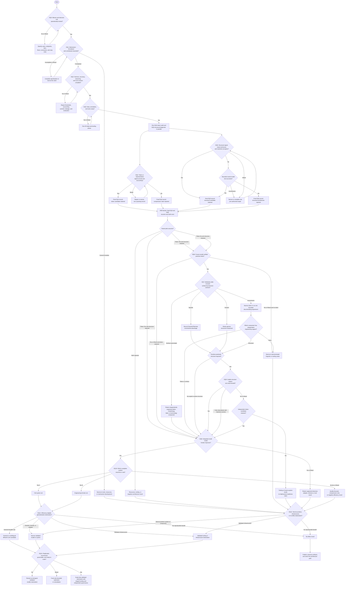

# Sanskrit-Derived Efficient LLM
## Research Question Register and Decision Tree

**Document type:** Programme navigation and stage-gate framework  
**Version:** 0.3.1  
**Date:** 21 August 2026  
**Status:** Pass 2 reviewed and aligned; DQ1 companion cross-link added

---

# 1. Purpose, Authority, and Naming

This document defines the questions that determine the programme's direction. It is not another architecture proposal. It is the journey-level control document for deciding:

- what is being built;
- which claims remain defensible;
- which experiment should happen next;
- when the programme should continue, pivot, narrow, pause, or stop;
- which successful destination has actually been reached.

The mission is no longer open-ended: the primary engineering destination is a general or multilingual efficient LLM. Sanskrit-native models, adapters, retrieval systems, tools, and corpora remain legitimate experimental or fallback destinations, but they are not co-primary objectives.

The signed Mission and Falsification Contract governed by DQ0 supersedes earlier companion-document classifications of hypotheses as primary, secondary, or exploratory. Under the present mission, propagation locality and self-assimilation are later or secondary endpoints rather than the main thesis.

## 1.1 Identifier namespace

- **DQ0-DQ14** are journey-level decision questions in this register.
- **E0-E5** remain evidence-producing experimental phases in the research architecture.
- **Legacy G0-G6** refer only to gates in Document 03.
- Pilot condition labels and structural-level labels belong to their source documents and must be cited with a document prefix where ambiguity is possible.

The DQ namespace does not replace the experimental phases or legacy gates. It decides whether the programme has earned entry into them.

An unanswered question is not a provisional “yes.” No expensive downstream phase should begin until its upstream decision has a recorded answer and supporting evidence.

---

# 2. Locked Mission and Decision Discipline

## 2.1 Locked objectives

> **Primary engineering objective:** develop a general or multilingual LLM that achieves a better verified accuracy-and-reasoning versus total-cost frontier through one or more representations or inductive biases derived from Sanskrit and Pāṇinian analysis.

> **Primary scientific objective:** determine causally whether any gain comes from Sanskrit surface form, morphology, Pāṇinian organization, structured information generally, or ordinary engineering choices.

A Sanskrit-native model is an experimental testbed. Adapters, retrieval systems, Sanskrit NLP tools, corpora, and domain-specific systems are valid narrower outcomes. Self-assimilation, writable memory, and controlled weight plasticity are outside Version 1.

## 2.2 Result tiers and primary decision rule

The programme must distinguish the full thesis from a useful Pareto improvement.

### Tier A — Full Version 1 system win

On the same sealed, predeclared workload mix, the candidate must:

1. reduce total model-consumed and model-generated sequential tokens at matched semantic content;
2. improve the preregistered accuracy endpoint by at least its minimum practically important effect;
3. improve the separate out-of-distribution reasoning endpoint by at least its minimum practically important effect;
4. reduce the declared complete-system cost; and
5. satisfy every capability, safety, coverage, latency, and information-budget floor.

If non-textual structure replaces text, its bits, nodes, edges, construction, transfer, and execution costs must also stay within the preregistered information and cost ceilings. A larger vocabulary cannot manufacture a token win by moving cost into embeddings or output heads.

### Tier B — Engineering-frontier win

A candidate that misses Tier A may still be a valid engineering result if, at a predeclared budget, it either:

1. improves verified accuracy and out-of-distribution reasoning without increasing the relevant complete-system cost; or
2. reduces that cost while remaining non-inferior on both.

Tier B is a useful efficient-system or component result, but it is not the full token-plus-accuracy-plus-reasoning thesis. Token count, sequence length, or compression alone is a mechanism result, not system efficiency.

The full core thesis requires both a Tier A system win and a Specific attribution result at DQ7.

## 2.3 System outcome by attribution

Engineering outcome and Sanskrit attribution are separate conclusions.

| System outcome | Specific Sanskrit/Pāṇinian advantage | No specific advantage or inconclusive |
|---|---|---|
| Tier A full system win | Full Version 1 core thesis supported | Strong efficient general system; Sanskrit was a source or design scaffold, not the unique cause |
| Tier B engineering-frontier win | Partial Sanskrit-derived engineering result; full thesis not yet met | Efficient generic structured system or component |
| No frontier win | Sanskrit-specific linguistic or mechanism effect, but not an efficient LLM | Stop the architecture claim; preserve useful resources and negative evidence |

“Inconclusive” never counts as “Specific.” It authorizes a narrower claim or one bounded discriminating experiment.

## 2.4 Cost ledgers and lifecycle boundary

Costs must be reported in separate ledgers before any optional aggregation:

1. **Representation ledger:** input, retrieved, cached, and generated tokens; raw and compressed bits; graph nodes, edges, vectors, and transfer bytes.
2. **Model-development ledger:** data acquisition, annotation, grammar and compiler engineering, tokenizer training, model training, tuning, failed runs, hardware time, energy, wall time, and money.
3. **Deployment ledger:** translation, normalization, parsing, graph construction, inference, retrieval, tools, retries, verification, storage, maintenance, latency, energy, and money per attempted request.
4. **Lifecycle scenario:** one preregistered deployment volume, workload mix, period, coverage requirement, and latency service level over which one-time costs may be amortized.

Training and inference costs must not be collapsed without the lifecycle scenario. Different units must not be hidden inside an unweighted “total cost” score. Report the cost vector, name the primary cost constraint, state conversion assumptions, and report both cost per attempted request and cost per correct result at fixed coverage. One-time research and development is disclosed separately from recurring production cost.

## 2.5 Decision record

Every DQ must have a decision record containing:

```text
Question ID
Status: Unanswered / Provisional / Final
Outcome: Yes / No / Mixed / question-specific category
Hypothesis and null hypothesis
Primary estimand and contrast
Evidence required
Strongest competing explanation
Baselines and controls
Minimum practically important effect
Non-inferiority margin and cost ceiling
Joint acceptance and confidence-interval rule
Multiplicity, sequential testing, and alpha-spending rule
Discovery, selection, and sealed-confirmation datasets
Uncertainty or confidence interval
Cost and resource implications
Decision: Continue / Pivot / Narrow / Pause / Stop
Decision owner and independent reviewer
Date, evidence links, and next review date
```

A DQ cannot pass from statistical significance alone. Before sealed results are opened, its threshold sheet must specify the primary contrast, practical effect, non-inferiority margins, cost ceiling, confidence-interval rule, multiplicity correction, and automatic Yes, No, and Inconclusive outcomes. Only a preregistered Yes advances a confirmatory claim. Mixed or Inconclusive follows the narrower branch unless a bounded repeat was authorized in advance.

## 2.6 Guardrails

The programme must preserve these distinctions:

1. **Token compression is not automatically compute efficiency.**
2. **Morphological competence is not automatically general reasoning.**
3. **A useful Sanskrit system is not automatically a Sanskrit-specific mechanism.**
4. **A Sanskrit-specific causal contribution is not automatically an algorithmically novel architecture.**
5. **A frozen-model adapter result is not automatically evidence for a more efficient foundation model.**
6. **Oracle structural success is not automatically practical feasibility.**
7. **A mechanism can merit empirical testing even when it is not algorithmically novel.**
8. **A negative attribution result must not erase a positive engineering result.**
9. **A negative token result must not erase a positive structural result, or vice versa.**
10. **A negative answer may select a valuable narrower destination rather than terminate all Sanskrit NLP work.**

---

# 3. Questions That Must Be Answered Before Decisive Experiments

## DQ0 — Mission and Decision-Rule Lock

### Decisive question

> Is the already-selected general or multilingual efficient-LLM mission operationally specified well enough to govern experiments and stop decisions?

### Supporting questions

- Who are the initial users, and which languages will they provide and receive?
- Is Sanskrit a user-facing language, an internal representation, a source of inductive bias, or some combination?
- Does Version 1 train a model, adapt a model, or compare both under a common system boundary?
- Which workloads and capabilities are in scope?
- What counts as accuracy: exact correctness, factual groundedness, calibration, executable task success, or a predeclared combination?
- What counts as reasoning beyond answer accuracy?
- Which accuracy and reasoning endpoints are separate and co-primary, and what fixed aggregation or gatekeeping rule prevents metric shopping?
- Which out-of-distribution tests cover unseen composition, counterfactual consistency, causal intervention, algorithm execution, paraphrase robustness, and distractor resistance?
- What non-inferiority floors prevent token or cost savings from purchasing unacceptable quality loss?
- Which token boundary, cost ledger, lifecycle workload, amortization horizon, coverage level, and latency service level are primary?
- Which exact observations constitute Tier A, Tier B, attribution-only, and mechanism-only outcomes?
- Which claims and components are explicitly outside Version 1?
- What exact observation would falsify the efficient-LLM claim?
- What exact observation would downgrade only the Sanskrit-attribution claim?

### Required decision artifact

A one-page **Mission and Falsification Contract** containing:

- the locked engineering and scientific objectives;
- one primary practical decision rule;
- operational accuracy and reasoning measures;
- Tier A and Tier B threshold sheets;
- target users, languages, workloads, and system boundary;
- token, information, training, deployment, and lifecycle accounting boundaries;
- regression floors;
- Version 1 exclusions;
- separate stop or downgrade conditions for engineering value and Sanskrit attribution.

### If unresolved

Pause architecture expansion. Specifications and small feasibility checks may continue, but no confirmatory model comparison may begin.

---

## DQ1 — Mechanism Specification and Contribution Boundary

### Decisive question

> What precisely is the Sanskrit-derived computational mechanism whose causal and practical value will be tested?

### Supporting questions

- Which parts are Sanskrit-derived, Pāṇinian, broadly linguistic, generic graph machinery, retrieval, or ordinary neural adaptation?
- What is the complete executable dataflow from input through tokenization, structural analysis, fusion, model computation, retrieval, and output?
- Is Sanskrit contributing surface language, tokenization, morphology, semantic roles, rule organization, inheritance, exception handling, scope, or an interaction?
- What is the minimal mechanism capable of producing the predicted gain?
- What are its node types, relation types, states, invariants, and transition rules?
- How do rule firing, precedence, optionality, conflict resolution, inheritance blocking, and ambiguity work?
- Where does it interact with the model: tokenizer, embedding layer, side channel, attention, training objective, retrieval, memory, or decoder?
- What are its time, memory, storage, annotation, and expert-engineering costs?
- Can a universal or generic formalism encode the same information and operations?
- Is the contribution empirical, architectural, algorithmic, linguistic, resource-based, or integrative?
- Which existing systems implement each component or close combination?
- What remains new after the strongest prior art is subtracted?
- Does Version 1 actually implement every structural layer invoked by the causal claim?

### Required evidence

- a formal mechanism specification;
- an executable toy implementation;
- an input-output worked example containing ambiguity and exceptions;
- a component-by-component prior-art and non-duplication matrix;
- information-equivalent universal and generic formulations;
- a claim-to-implemented-layer traceability table.

Document 08, **DQ1 Mechanism Resolution Contract**, decomposes this work into DQ1-M0 specification freeze, DQ1-M1 deterministic reference interpreter, and DQ1-M2 contribution-boundary closure. These are work packages, not additional decision questions. M0 or M1 may pass while `DQ1 status = Unanswered` and `DQ1 readiness = Not Ready`; only the complete six-item evidence set may close DQ1.

### Consequences

- **Cannot be formalized or implemented:** pause the architecture experiment and narrow the programme to tools, resources, or mechanism development.
- **Formalizable but not algorithmically novel:** continue as an empirical, integration, linguistic, or engineering contribution with a downgraded novelty claim.
- **Formalizable and plausibly novel:** test it; novelty remains unproven until prior-art and experimental evidence survive review.
- **Generic mechanism inspired by Sanskrit:** continue testing without describing it as Sanskrit-unique.

---

## DQ2 — Measurement, Reasoning, and Fairness Contract

### Decisive question

> Can every target condition and baseline be compared without giving one condition hidden information, capacity, data, labour, or cost?

### Supporting questions

#### Accuracy and reasoning

- Which separate co-primary measures represent accuracy and out-of-distribution reasoning?
- Which secondary measures represent groundedness, calibration, abstention, robustness, and end-task success?
- Which tasks test held-out rule combinations, nonce entities, reversed correlations, counterfactual rules, causal interventions, algorithm execution, paraphrases, and irrelevant distractors?
- Which outputs can be verified deterministically or by blinded independent adjudication?
- Are reasoning tasks independent of the Sanskrit annotations and structure used to train or compile the treatment?
- Is the aggregation and gatekeeping rule frozen so that gains on structure-aligned synthetic tasks cannot mask failure on user-valued workloads?
- Is generated chain-of-thought treated only as a cost or diagnostic unless its causal faithfulness is independently established?
- Are generated reasoning tokens, model calls, tool calls, retrieval calls, retries, and search branches counted?
- What predeclared regression floors apply to general capabilities and safety-relevant behaviour?

#### Information and capacity

- Are matched-semantic-content and matched-resource-budget comparisons defined as separate estimands rather than merged?
- Do all conditions receive the same facts, relations, evidence, and supervision?
- Does any side channel encode more task-relevant information than its control despite equal nominal size or nominal “semantic equivalence”?
- Can adversarial probes recover answers, proof steps, evaluator labels, or decompositions from the side channel alone?
- Are encoded bits, relation inventory, compiler supervision, and provenance audited in addition to graph size?
- Are gold answers, proof steps, decompositions, consequences, and test-derived labels evaluator-only?
- Are total parameters, trainable parameters, vocabulary size, and embedding/output-head costs separately reported?
- Does the smaller structured model beat the strongest ordinary model available at the same total latency or FLOPs?
- Are context, retrieval, output, and hyperparameter-search budgets matched?

#### Cost and reproducibility

- How are raw bytes, compressed bits, tokens, graph nodes, edges, vectors, storage, and bandwidth counted?
- How are translation, normalization, parsing, graph construction, annotation, grammar engineering, compiler development, and tuning hours counted or separately disclosed?
- How is unequal English and Sanskrit pretraining exposure handled?
- Are there separate controlled-exposure and real-world-pretrained estimands, rather than treating one pretrained backbone as a deconfounded language comparison?
- How is a new tokenizer made compatible with a frozen pretrained model?
- Are hardware, kernels, quantization, batching, seeds, and stopping rules controlled?
- Are baseline implementations, competence tests, maintainers, and tuning budgets frozen before sealed evaluation?
- Are discovery, component selection, and confirmation separated, with one final candidate frozen before a fresh sealed run?
- Does sequential screening use preregistered alpha spending or another valid selective-inference rule?
- What effect size is practically meaningful?
- What power analysis, clustered uncertainty estimate, multiple-comparison correction, holdout, and seed policy is required?
- Which implementation defects may be corrected after preregistration, and which changes require a new experiment?

### Required evidence

A preregistration, endpoint specification, resource-accounting specification, information-equivalence audit, leakage audit, and statistical analysis plan.

### If fairness cannot be established

Do not interpret a performance difference causally. Redesign the comparison or limit the claim to an uncontrolled observation.

---

## DQ3 — Data, Annotation, and Tooling Readiness

### Decisive question

> Can the hypothesis be tested using independently reviewed data and tools that do not encode the desired conclusion?

### Supporting questions

- Are tokenizer-training, development, and sealed evaluation corpora disjoint?
- Could a pretrained backbone have seen any evaluation world, translation, rule set, benchmark, or near duplicate?
- Where pretraining contamination cannot be excluded, do clean-room fictional, nonce, or procedurally generated tests carry the confirmatory claim?
- Are corpus size and domain distributions matched fairly across languages?
- Are Sanskrit and comparison-language items semantically equivalent rather than merely similar?
- Are translations natural, independently produced, and blinded to the compression hypothesis where possible?
- Are multiple valid Sanskrit renderings preserved rather than selecting only the shortest or most transparent?
- Are attested, translated, expert-proposed, standardized, and model-generated items separately labelled?
- Are fictional, modern technical, and attested natural worlds all represented?
- Are lexicalization, polysemy, ambiguity, exceptions, domain, time, and register represented?
- What is inter-annotator agreement by structural layer?
- Are disagreements retained and adjudicated rather than silently collapsed?
- Is every record licensed, attributable, versioned, and provenance-bearing?
- Are synthetic-data feedback loops prevented?
- Is there enough data for the planned conditions, holdouts, seeds, and effect sizes?
- Can oracle, rule-generated, neural-predicted, ensemble, deliberately noisy, corrupted, universal, and generic structures all be produced?

### Required evidence

A Version 1 coverage contract, annotation manual, agreement study, provenance audit, sealed-split manifest, oracle structural set, baseline compilers, and tool-quality report.

### If not ready

Run a data-and-tooling phase. Do not begin the decisive model comparison.

---

# 4. Cross-Document Phase and Gate Alignment

| Journey decision | Evidence-producing phase | Legacy Document 03 gate | Pilot role |
|---|---|---|---|
| DQ0-DQ2 | Pre-phase specification | None | Mission, preregistration, accounting |
| DQ3 | E0 representation and data pilot | G0 | Shared data, schema, and tooling readiness |
| DQ4 | Parallel token audit T0 | None | Track 1 |
| DQ5 | E1 graph-only falsification | G1 | Required Track 2A diagnostic |
| DQ6 | E2 frozen-model experiment | G2 | Track 2B practical and causal value |
| DQ7 | E2 confirmatory controls | G3 | Causal attribution and specificity isolation |
| DQ8 | Late E2 feasibility evidence | G4 evidence | Oracle-to-usable-structure comparison |
| DQ9-DQ10 | E3 joint training and complete-system audit | No exact legacy equivalent | Follow-on integrated experiment |
| DQ11 | Cross-domain and cross-backbone validation | Part of G6 preconditions | Transfer and product-scope evidence |
| DQ12 | E4 writable external memory | G5 outcome | Optional later branch |
| DQ13 | E5 controlled plasticity | Separate later validation | Optional later branch |
| DQ14 | Post-branch replication and scale decision | G6 | Funding and scale decision |

## 4.1 Canonical sequencing rules

1. DQ4 and DQ5 run independently and in parallel.
2. DQ6 may begin only after both DQ4 and DQ5 decision records exist, except for the bounded oracle test authorized after a DQ5 failure.
3. Track 1's custom-tokenizer result feeds E3 and DQ9, not E2. The frozen backbone in E2 retains its native tokenizer.
4. DQ5 is a cheap structural diagnostic. DQ7 alone adjudicates incremental Sanskrit/Pāṇinian attribution.
5. E1 alone does not authorize E3 for the efficient-LLM claim. DQ6 must pass for a structural component to enter E3. A positive DQ4 may independently authorize a token-only DQ9 experiment.
6. A negative DQ7 changes attribution to generic or inconclusive; it does not terminate a component with demonstrated engineering value.
7. DQ8 is required whenever the deployed system predicts, constructs, or consumes explicit structure at inference, whether through an external parser or a jointly learned internal predictor. Only training-only supervision or a fully distilled/internalized design with no runtime structural prediction or consumption may bypass runtime feasibility.
8. The pilot must either implement a minimal rule-scope core covering defaults, precedence, optionality, blocking, and exceptions, or narrow its causal claim to the structural layers actually implemented.
9. Self-assimilation remains outside the Version 1 journey even when Documents 03-05 provide later-stage designs.
10. Bypassing runtime feasibility never bypasses causal attribution. A training-only or distilled design must repeat the DQ7 supervision controls with Pāṇinian, universal, generic, anonymized, counterfactual, and shuffled supervision at matched teacher, data, and tuning budgets.
11. DQ4-DQ8 are discovery and selection stages. One final candidate must be frozen before DQ9 and evaluated on a fresh sealed confirmation set under the preregistered sequential-testing rule.

---

# 5. Questions Answered by the Representation and Frozen-Model Pilots

## DQ4 — Token and Representation Efficiency

### Decisive question

> Does a Sanskrit-native representation carry equivalent modern content more efficiently under fair tokenizer and information accounting?

### Supporting questions

- Does Sanskrit reduce median and tail sequence length across modern prose, science, mathematics, algorithms, law, dialogue, and code explanation?
- Does the result survive multiple tokenizer families and vocabulary sizes?
- Does it survive held-out domains and unseen terminology?
- Is the gain present in compressed bits or bytes, not only token count?
- What vocabulary and embedding-memory cost is required?
- Does morphology-aware tokenization improve consistency, model loss, accuracy, or generalization even when token count does not fall?
- Does shorter sequence length reduce measured KV-cache use, latency, energy, or FLOPs?
- Does translation into Sanskrit add more cost or error than the representation saves?
- Does the structural tokenizer outperform a strong ordinary Sanskrit tokenizer?
- Do natural Sanskrit, controlled or canonical Sanskrit, and deliberately engineered terminology produce distinguishable results?
- Does the comparison include controlled or compressed English and a non-linguistic meaning representation so that “engineered compact notation” is not mislabelled as a Sanskrit effect?
- Does the token ledger include input, retrieved context, generated reasoning, tool-mediated prompts, retries, and all calls required for the same verified task?

### Pass consequence

Retain tokenization or representation economy as a candidate component. Park it for the integrated DQ9 experiment; do not treat token reduction alone as model efficiency.

### No consequence

Drop the Sanskrit-compression claim. Continue the structural branch independently. A negative DQ4 does not block DQ5-DQ8.

---

## DQ5 — Graph-Only Structural Signal Diagnostic

### Decisive question

> Before involving an LLM, does the pre-specified Sanskrit/Pāṇinian-derived organization show a reproducible structural signal relative to text/vector and matched corrupted-structure controls?

### Supporting questions

- Does it improve compositional relation inference?
- Does it improve exception-sensitive rule application?
- Does it improve scope and attachment disambiguation?
- Does it improve counterfactual rule execution?
- Does it improve generalization to unseen combinations of familiar components?
- Does shuffled, type-preserving, or otherwise matched corrupted organization remove the gain?
- Were diagnostic tasks and evaluators generated independently of the candidate representation?
- Must every control pass a competence test showing that it can express and execute the same rules, exceptions, and semantic information?
- Which implemented layers and cross-layer interactions cause the effect?
- Does the signal survive family, sense, domain, register, and topology holdouts?
- Is the signal larger than the added graph operations, storage, and construction cost?
- Do universal or generic controls reveal a possible alternative explanation that DQ7 must later adjudicate?

### Passing diagnostic

The pre-specified structure reproducibly beats text/vector and well-matched corrupted structure on preregistered diagnostic tasks. Universal and generic results may be reported here, but they do not determine Sanskrit specificity.

### Consequences

- **Pass:** retain the structural component and proceed to DQ6 after both parallel pilot records exist.
- **No:** permit one bounded, preregistered oracle frozen-model test if the diagnostics may miss the intended neural interaction.
- **Diagnostic and bounded oracle both fail:** stop the distinctive structural architecture claim. Preserve useful datasets, schemas, parsers, and Sanskrit NLP resources.
- **DQ4 passed despite structural failure:** continue a token-only path to DQ9.

---

## DQ6 — Frozen-Model Practical and Causal Value

### Decisive question

> With one identical frozen backbone, does the structural condition improve verified outcomes at a matched total information and compute budget?

### Supporting questions

- Does it improve exact, numerical, executable, grounded, or unit-tested correctness?
- Does it improve held-out rule combinations, nonce entities, reversed correlations, and novel composition?
- Does it remain robust to paraphrases and irrelevant distractors?
- Does it execute counterfactual rules and respond predictably to causal interventions?
- Does it improve accuracy at fixed textual, side-channel, and total-compute budgets?
- Does it reach target accuracy with fewer concept exposures?
- Does it reduce generated reasoning tokens, model calls, retrieval calls, retries, or search branches at matched verified correctness?
- Does it preserve or improve calibration, abstention, and ambiguity handling?
- Does it avoid degrading general reasoning and unrelated capabilities?
- Do interventions on roles, derivations, exceptions, scope, or graph identity change behaviour predictably?
- Does removing or corrupting the side channel remove the gain?
- Are the fusion adapter, trainable parameters, optimization steps, and hyperparameter budget matched to learned-extra-capacity and extra-compute controls?
- Can every structural input be derived solely from information available at deployment time?
- Does the side channel encode an answer, proof step, task decomposition, or test-derived signal unavailable to controls?
- Are effects stable across seeds, prompts, evaluators, and templates?

### Consequences

- **Pass:** proceed to DQ7 for causal attribution.
- **No, while DQ4 passed:** drop the structural component and continue a token-only DQ9 experiment.
- **No, with no token candidate:** narrow to demonstrated linguistic, data, or tooling outcomes and proceed to DQ11 for scope assessment.

---

## DQ7 — Causal Attribution: Sanskrit/Pāṇinian vs Generic Structure

### Decisive question

> Does the Sanskrit/Pāṇinian-derived mechanism add incremental causal value over the strongest information-, capacity-, and cost-matched alternatives?

### Required attribution design

The frozen-model comparison estimates structural effects **conditional on the backbone's native tokenizer**. It must not claim to isolate tokenizer effects. At minimum, cross each surface or input condition with separately implemented structural conditions:

| Surface or input | Pāṇinian-derived | Universal linguistic | Generic executable | No explicit structure |
|---|---:|---:|---:|---:|
| Sanskrit | Required | Required | Required | Required |
| English or matched non-Sanskrit | Required | Required | Required | Required |

Also include:

- learned latent structure with the same supervision and data budget;
- label-anonymized and well-formed counterfactual structural controls;
- a well-formed alternative natural-language or formal-grammar representation;
- an English-input to Pāṇinian-internal-structure to English-output condition;
- matched students trained with Pāṇinian, universal, generic, anonymized, counterfactual, and shuffled supervision when the mechanism is training-only or distilled.

Two estimands are required:

1. **Controlled-exposure estimand:** matched-from-scratch small models or isomorphic encodings with balanced exposure, item-level parallel semantics, and counterbalanced mappings.
2. **Ecological estimand:** the real pretrained backbone, with its unequal language exposure and translation or compilation errors explicitly treated as part of deployment reality rather than as a deconfounded language experiment.

Predeclare the Pāṇinian-versus-universal contrast, Pāṇinian-versus-generic contrast, surface main effect, structure main effect, surface-by-structure interaction, label-semantics effect, and compilation-fidelity mediation analysis. DQ4 and DQ9, not this frozen native-tokenizer experiment, adjudicate tokenizer and morphology contributions.

### Supporting questions

- Are semantic information, encoded bits, representation bandwidth, rule count, graph complexity, inference depth, total parameters, teacher capacity, and compute matched?
- Do all structural controls pass preregistered competence and fidelity checks before their comparative results are unsealed?
- Are translation and compilation fidelity measured per item and prevented from becoming an unmeasured treatment bundle?
- Does anonymizing Sanskrit labels preserve the gain?
- Do well-formed counterfactual structures remove the gain, rather than only nonsensical rewiring?
- Do layer and cross-layer ablations identify a responsible mechanism?
- Does the effect survive natural Sanskrit rather than only constructed terminology?
- Is the same claim supported when scope, defaults, precedence, optionality, blocking, and exceptions are actually implemented?
- Are the estimated main effects and interactions identifiable with adequate power?

### Attribution record

Classify the result as:

- **Specific:** a practically meaningful Pāṇinian contrast over competent universal and generic alternatives under the controlled-exposure design, with a compatible ecological result;
- **Generic:** explicit or procedural structure explains the benefit;
- **Surface-associated:** the effect tracks surface form, terminology, label semantics, or pretraining exposure; tokenizer and morphology attribution remains for DQ4 and DQ9;
- **Inconclusive:** controls or power do not separate the explanations.

This is a causal-attribution decision, not a prior-art novelty decision. Novelty remains governed by DQ1.

### Consequence of no Sanskrit-specific advantage

Record generic, surface-associated, or inconclusive attribution and continue only the independently supported component. A Generic result retains the structural path. A Surface-associated result drops the unsupported structural component and retains only a surface, token, morphology, label, or terminology component independently supported by DQ4 or a bounded follow-up. An Inconclusive result permits one bounded discriminating experiment or a narrowed attribution claim. Do not discard an efficient generic structured model merely because Sanskrit is not the unique cause.

---

## DQ8 — Usable-Structure Feasibility

### Decisive question

> Can the intended system obtain usable structure through an external parser, joint prediction, distillation, or training-only supervision while retaining enough oracle benefit at acceptable complete-system cost?

### Entry question

Does the deployed system predict, construct, or consume explicit structure at inference?

- **No:** record the training-only or fully distilled/internalized mechanism and proceed to DQ9 after matched causal-supervision controls; no runtime-parser pass is required.
- **Yes:** evaluate the full oracle-to-usable-structure utility and cost curve, including a jointly learned internal predictor.

### Supporting questions

- What proportion of oracle gain survives rule-generated, neural-predicted, ensemble, and jointly learned analysis?
- Is the oracle effect itself positive, practically meaningful, and estimated precisely enough for a retention ratio to be interpretable?
- What is net benefit after parser, graph, latency, storage, maintenance, and error costs?
- Which structural layers are practical bottlenecks?
- How do segmentation, derivation, compound, role, sense, scope, exception, and coreference errors propagate?
- Can uncertainty remain as a lattice rather than forcing one premature analysis?
- How does utility change with calibrated structural noise?
- Does the system detect out-of-vocabulary forms, domain shift, and low-confidence analyses?
- Can human corrections be incorporated without contaminating sealed evaluation?
- Does the usable mechanism implement every layer named in the causal claim?
- Is there a bounded path from current tooling to the required frontier?

### Provisional readiness rule

The governing evidence is absolute net utility with a confidence interval against baseline and a preregistered runtime cost ceiling. Oracle-retention percentage is diagnostic only.

First require an oracle effect whose magnitude exceeds the minimum practically important effect and whose confidence interval does not include a null or harmful effect. If the oracle denominator is tiny, negative, or too uncertain, no retention percentage may be reported as a gate.

Conditional on that prerequisite, the companion documents' thresholds are reconciled provisionally as:

- **At least 70% oracle-gain retention, positive absolute net utility, and cost below the ceiling:** practical readiness pass.
- **50% to below 70%:** tooling or claim-narrowing outcome, not an architecture-readiness pass.
- **Below 50%:** fail unless a bounded tool-improvement or internalization plan is approved.

### No consequence

Try a bounded joint-prediction, distillation, or training-only redesign if the mechanism permits it. Otherwise retain a tooling programme or continue only with an independently successful token component. Do not claim deployment readiness for runtime structure.

---

# 6. Questions Answered by Actual Model Development

## DQ9 — Integrated Small-Model Frontier

### Decisive question

> Does any retained component originating from the Sanskrit/Pāṇinian hypotheses, alone or in combination, improve the verified accuracy-and-out-of-distribution-reasoning versus total-training-cost frontier?

### Supporting questions

- How is tokenizer and backbone compatibility resolved?
- Which component wins alone: surface language, tokenizer, morphology, internal structure, fusion, or auxiliary objective?
- Do combinations add value beyond their strongest component?
- At matched total parameters, data, and training FLOPs, does the candidate reach target verified quality sooner?
- Does it require fewer pretraining tokens, examples, or concept exposures?
- Does it produce more verified correct results per unit of total training compute at a fixed deployment configuration?
- What separate deployment frontier will DQ10 test rather than being blended into the training result?
- Does the structural objective improve held-out composition and intervention tests, or only its auxiliary task?
- Are gains present at more than one small-model scale?
- How does performance scale with data, parameters, structure quality, and graph size?
- Are scaling-law fits reported with uncertainty and without extrapolating a large-model claim beyond the tested range?
- Does the integrated model beat the frozen-adapter system after all development and execution costs are counted?
- Do general-capability and safety regression floors hold?
- Is the result a more efficient general model, an efficient Sanskrit model, or an effective augmentation system?

### Minimum credible experiment

Freeze one final candidate after DQ4-DQ8 discovery, then use a fresh sealed confirmation set, at least two modest model sizes, multiple seeds, and:

- both parameter-matched and compute-matched ordinary-model baselines;
- matched-semantic-content comparisons and separate token-budget curves;
- preregistered general-capability and safety regression floors;
- the fixed primary contrasts, selection correction, and joint acceptance rule.

Apply component-specific conditions:

- **Token or morphology candidate retained:** ordinary statistical tokenization, morphology-aware tokenization, natural Sanskrit, controlled or canonical Sanskrit, controlled comparison-language text, and vocabulary/head-cost controls.
- **Structural candidate retained:** universal structure, generic executable structure, the Pāṇinian-derived mechanism, competence-tested controls, and the applicable DQ7 crossed conditions.
- **Both retained:** each component alone and their combination, with an interaction estimate.

Plot verified accuracy and reasoning against training tokens, examples, FLOPs, wall time, and total cost.

### No consequence

Retain a useful tokenizer, frozen adapter, retrieval system, or tool if supported, but stop claiming a more efficient foundation-model training architecture. Proceed to DQ11 to define the narrower scope.

---

## DQ10 — Complete-System Efficiency

### Decisive question

> Which locked result tier, if any, does the complete system satisfy after every textual and non-textual cost is counted?

### Supporting questions

- What are total FLOPs, energy, p50 and p95 latency, peak memory, KV-cache use, storage, and monetary cost per verified correct result?
- Are translation, normalization, parsing, graph construction, side-channel encoding, fusion, retrieval, caching, retries, and failed calls included?
- Are input tokens, generated reasoning tokens, graph nodes, edges, vectors, bytes, and bandwidth reported?
- Are hardware, kernels, quantization, batching, context length, and output format matched?
- Is the advantage preserved at realistic throughput and amortization?
- Is the primary lifecycle scenario fixed before results, including deployment volume, workload mix, period, coverage, and latency service level?
- Are cost per attempted request and cost per correct result both reported at fixed coverage?
- Does it hold in short and long contexts and low- and high-retrieval workloads?
- Do both verified accuracy and out-of-distribution reasoning remain above their regression floors?

### Outcome tiers

- **Tier A full system win:** total sequential-token use and complete-system cost both fall; accuracy and out-of-distribution reasoning both improve by their practical margins; every floor and ceiling holds.
- **Tier B cost win:** complete-system cost falls while accuracy and reasoning are both non-inferior.
- **Tier B quality win:** accuracy and reasoning both improve while complete-system cost is non-higher.
- **Quality rises but cost also rises:** quality-focused system result, not an efficiency pass.
- **Text tokens fall but complete cost does not:** representation or context-compression result only.
- **Cost falls by violating a quality, coverage, latency, or information floor:** failure, not efficiency.
- **Neither quality nor cost improves:** stop the efficiency architecture claim.

Every outcome proceeds to DQ11 so its actual generalization and product scope can be named.

---

## DQ11 — Generalization and Destination Selection

### Entry constraint

Only a DQ10 Tier A or Tier B result may enter the **general or multilingual efficient-LLM** destination. Outcomes routed here after DQ6, DQ8, DQ9, or DQ10 failure are assessed only to name a narrower model, component, tooling, infrastructure, or negative-result destination; DQ11 cannot revive a rejected efficiency claim.

### Decisive question

> Where does the demonstrated benefit generalize, and which destination does the evidence justify?

### Supporting questions

- Does the result survive clean-room fictional, modern technical, and attested natural Sanskrit worlds?
- Does it survive new concept families, senses, domains, registers, authors, and time periods?
- Does an English-input and English-output model benefit from a Sanskrit-derived internal representation?
- Does the effect transfer to other Indic and non-Indic languages?
- Does it outperform comparable language-specific structure from another morphologically rich language?
- Does translation or compilation introduce unacceptable latency or factual error?
- Does it work on user-valued tasks rather than only structure-aligned benchmarks?
- Does the gain survive a second internal backbone or model family, independent prompts, seeds, and evaluators?
- What is cost per verified correct result at realistic workloads?
- What accessibility, expertise, maintenance, and deployment constraints remain?

### Result destinations

- **General or multilingual benefit after DQ10 Tier A or B:** candidate general efficient LLM architecture.
- **Sanskrit-only model benefit:** Sanskrit-native model.
- **Frozen-model benefit without training-frontier gain:** adapter, retrieval, or augmentation system.
- **Selected-domain benefit:** domain-specific structured reasoning system.
- **Tokenizer-only benefit:** representation or tokenizer system pending complete-cost qualification.
- **Tooling or data benefit only:** Sanskrit NLP infrastructure programme.
- **No reproducible benefit:** negative result and preserved reusable resources.

A Sanskrit-only or domain-specific result is not a failed generalization test disguised as success. It is a narrower destination with a correspondingly narrower public claim.

### Provisional breadth contract

Unless DQ0 justifies a stricter contract:

- “multilingual” requires Sanskrit plus at least three non-Sanskrit languages spanning at least two language families and two scripts, including at least one non-Indic language;
- “general” requires at least three user-valued domains and four independently constructed reasoning task families;
- both claims require at least two backbone or model families, natural and clean-room material, fixed regression floors, and evaluators independent of dataset and terminology construction.

Before this breadth is met, describe the result as a cross-lingual or cross-domain pilot, not a general efficient LLM.

---

# 7. Optional Later Branch: Self-Assimilation

Self-assimilation is outside Version 1 and outside the main decision tree. It may be reconsidered only after DQ9-DQ11 establish a useful static model or structural system and a separate later mission is approved. In that later programme, DQ12 Yes leads to DQ13; DQ13 Yes returns the controlled-plasticity candidate to a fresh, destination-specific DQ14 review. Mixed or No never authorizes durable plasticity.

## DQ12 — Writable Memory and Update Locality

### Decisive question

> Does reversible external memory improve knowledge acquisition and correction while propagating updates only where they belong?

### Supporting questions

- Which facts should inherit an update, and which must remain unchanged?
- Does propagation recall improve at a fixed non-target preservation level?
- Are homonyms, lexicalized meanings, domains, registers, time ranges, and protected exceptions preserved?
- Can at least 100 sequential updates retain locality and calibration?
- Are conflicts, provenance, evidence, confidence, and scope auditable?
- Does rollback restore the prior state within tolerance?
- Is the update reproducible across instances?
- Can poisoning, circular evidence, and self-confirmation be detected and quarantined?
- Does external memory outperform ordinary retrieval or model-editing baselines at matched cost?

### Consequences

- **Yes:** DQ13 may begin under a separately approved later mission.
- **Mixed:** retain reversible external memory, remediate or narrow, and do not enter controlled plasticity.
- **No:** keep the validated static or retrieval-augmented model and do not add controlled plasticity.

---

## DQ13 — Controlled Plasticity

### Decisive question

> Do routing, temporary adapters, fast weights, or consolidation add value beyond reversible memory without unacceptable forgetting or loss of control?

### Supporting questions

- What information must enter weights rather than remain in external memory?
- Does adaptation improve accuracy or latency enough to justify risk and cost?
- Can every adaptation be scoped, versioned, expired, rolled back, and reproduced?
- Are unrelated capabilities preserved?
- Does the system resist malicious or low-quality updates?
- Who authorizes consolidation into durable weights?
- Can audit traces demonstrate the causal effect of adaptation?

### Consequences

- **Yes:** create a controlled-plasticity candidate that requires its own DQ14 replication, safety, economics, and governance review.
- **Mixed or No:** retain external institutional memory and frozen weights; prohibit durable consolidation.

---

# 8. Scale and Funding Decision

## DQ14 — Replication, Economics, and Governance

### Entry constraint

Only a reproducibly positive model, system, component, tool, dataset, or infrastructure destination enters DQ14. A pure no-effect result goes directly to publication, artifact preservation, and closure; it is not a scale candidate.

### Decisive question

> Has the strongest validated destination been independently replicated and earned substantial funding or a larger model, system, or infrastructure deployment?

### Supporting questions

- For model claims, does the principal effect reproduce across at least two backbones and model sizes?
- For infrastructure claims, does the principal value reproduce across tools, domains, or independent adopters?
- Does an independent team reproduce the claim relevant to that destination?
- Do confidence intervals and practical effect sizes support the claim?
- Does the advantage survive usable rather than oracle structure?
- Does it survive natural and modern material?
- Are complete training, inference, data, annotation, parser, storage, engineering, and maintenance costs proportionate to benefit?
- Is enough lawful, high-quality data available to scale?
- Are benchmarks independent of the training and terminology-development teams?
- Are licensing, provenance, security, red-team, release, and model-governance plans complete?
- Is there a staged budget with explicit kill points?
- Which claim will be made publicly, and which claims remain prohibited?
- For a model or adapter, do cross-backbone and cross-scale results justify the proposed model scale?
- For a parser, corpus, benchmark, or other infrastructure, do cross-tool or cross-domain adoption, maintenance, and public-value evidence justify infrastructure scale?
- For a controlled-plasticity system, have memory safety, rollback, authorization, and adversarial-update results independently reproduced?

### Consequences

- **Pass:** scale only the validated destination—model, system, or infrastructure—with destination-specific milestones, staged funding, and independent governance.
- **Mixed:** fund only the bounded replication or remediation needed to resolve the named uncertainty.
- **No:** remain at the strongest validated smaller destination and publish positive, negative, and inconclusive findings.

---

# 9. Programme Decision Tree

The parallel pilot branches produce separate records. The diagram's AND barrier is declarative: it cannot fire until both records are Final. Provisional or Mixed records do not satisfy it, and completion is not evidence that either branch passed.



---

# 10. Interpretation of Possible Journeys

| Destination | Evidence required | Claim prohibited without further evidence |
|---|---|---|
| Sanskrit resources and tools | Useful corpora, parsers, schemas, benchmarks, or terminology infrastructure | Superior LLM architecture |
| Efficient Sanskrit NLP or model | Better Sanskrit representation, analysis, or task performance at acceptable cost | General multilingual reasoning superiority |
| Generic structured LLM inspired by Sanskrit | Explicit or procedural structure improves the quality-cost frontier | Sanskrit-specific computational uniqueness |
| Sanskrit-derived adapter or retrieval system | Existing LLMs benefit from a structural side channel | More efficient foundation-model pretraining |
| General or multilingual engineering-frontier LLM | DQ10 Tier B and the DQ11 breadth contract pass | The full token-plus-accuracy-plus-reasoning thesis |
| Full Sanskrit-derived efficient-LLM thesis | DQ10 Tier A, DQ7 Specific, the DQ11 breadth contract, and DQ14 replication pass | Unqualified Sanskrit uniqueness beyond the tested mechanisms and controls |
| Self-assimilating institutional system | Later DQ12-DQ13 evidence for reversible memory and controlled updates | Automatic inclusion in the Version 1 thesis |

---

# 11. Immediate Question Queue

The next programme meeting should answer or assign these questions in order:

1. Approve the locked general or multilingual LLM mission and Version 1 exclusions.
2. Freeze the strict Tier A thesis rule, Tier B engineering rule, and every regression floor.
3. Freeze representation, training, deployment, and lifecycle ledgers, including workload volume, coverage, amortization, and latency.
4. Define accuracy and out-of-distribution reasoning as separate co-primary endpoints with practical margins and a fixed aggregation rule.
5. Enumerate Sanskrit contribution hypotheses and select the minimal executable mechanism.
6. Separate scientific, engineering, novelty, and product claims.
7. Freeze the controlled-exposure and ecological attribution designs, including all causal contrasts.
8. Freeze information-equivalence, leakage probes, threshold sheets, multiplicity control, and Yes/No/Inconclusive rules.
9. Resolve tokenizer and backbone compatibility and define natural, controlled, and engineered language conditions.
10. Freeze contamination-resistant discovery, selection, and fresh sealed-confirmation data.
11. Name and competence-test universal, generic, learned, controlled-language, and alternative-language baselines before unsealing results.
12. Decide whether deployed structure is runtime, jointly predicted, fully distilled, or training-only, and attach the correct DQ7/DQ8 controls.
13. Freeze the Tier-by-attribution matrix, the DQ11 breadth contract, and the consequence of every cell.
14. Set the available compute, data, expert-labour, time, and lifecycle envelope.
15. Assign DQ owners and independent reviewers.

Until Items 1-11 are answered, implementation should be limited to specifications, data prototypes, baseline prototypes, and small feasibility checks.

---

# 12. Review History and Governing Rule

- **Pass 1:** mission lock, engineering-versus-attribution separation, cross-document phase alignment, fairness expansion, and decision-tree repair.
- **Pass 2:** strict core-versus-frontier result tiers, lifecycle accounting, executable threshold discipline, controlled-versus-ecological estimands, selection-bias controls, oracle-ratio repair, generalization breadth, mixed-outcome routing, and terminal-branch validation.
- **Editorial amendment 0.3.1, 21 August 2026:** added the Document 08 DQ1 work-package cross-link and separated DQ status from readiness; no journey branch or evidence requirement changed.

> **The next phase is chosen by the answer to the current decision question, not by attachment to the original architecture.**

A successful journey is not necessarily the longest branch. The correct destination is the strongest system and claim that survive fair comparison, causal testing, complete-cost accounting, and independent replication.
